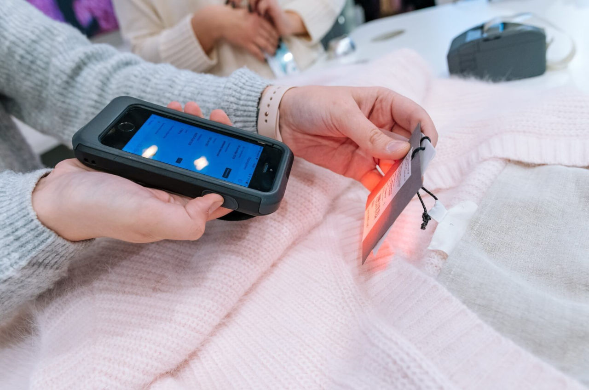

Hi, my name is Evgeny.

I'm an iOS developer with over 6+ years of experience, and I'm currently looking for a job (remote or relocation). Feel free to contact me:

Email: [e.seliverstov@outlook.com](mailto:e.seliverstov@outlook.com?subject=[GitHub]%20iOS%20Developer%20position)

LinkedIn: [linkedin.com/in/e-seliverstov/](https://www.linkedin.com/in/e-seliverstov/)

Some of projects I worked on:

#### 1. Making credit card payments using an iOS device as a terminal

It uses an external terminal connected using the Lightning port, but all the transaction processing and communication with the bank are done on the iOS host device.

  
Demo 2: Contact payment, YouTube video 0:36 duration

I implemented direct integration with SmartVista, OpenWay, and TranzWare Online payment processing systems. As a result, it works with almost every bank worldwide.

I also rewrote this project in Java, making it available for Android, Windows, and Linux.

#### 2. Automation of internal business processes for large retail stores

App that helps employees perform their tasks, such as printing price tags and product labels, conducting inventory, shipping and receiving products, managing sales and deliveries, etc. This not only saves employees valuable time but also translates into significant cost savings for the companies.

I worked on this project for more than three years as a solo developer and significantly improved it's functionality and stability.